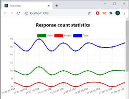
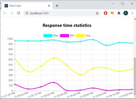

# Introduction
 
 TODO

# Technologies

Database: MongoDB

Server: Node.js, Express.js

Client: React, Chart.js

# Installation
 - Download and install Node.js. Instruction [here](https://nodejs.dev/learn/how-to-install-nodejs). 
 - Download and install MongoDB. Instruction [here](https://docs.mongodb.com/manual/administration/install-community/).

# Launch

## Database
Start MongoDB service (this can vary according to the OS - please follow the documentation)

## Server
 - navigate to `server` directory
 - install dependencies by executing the following command:

    ```
    npm install
    ```

- to start server in development mode (with hot reload):
  ```
  npm run start-dev
  ```
- to start in production mode:
  ```
  npm run start
  ```
Server will be started on `localhost:4000`

## Client
- navigate to `client` directory
 - install dependencies by executing the following command:

    ```
    npm install
    ```

- to start Client Application in development mode (with hot reload):
  ```
  npm run start
  ```
  Application will be available on `localhost:3000`
- to build for production:
  ```
  npm run build
  ```
    Application build will be available in `build` directory.

## Traffic simulator

To simulate traffic for testing purposes:

- navigate to `server` directory

- execute the following command:
    ```
    node traffic-simulator.js
    ```
The script will send valid requests to the monitored endpoint each 1s and invalid requests each 1.5s.

## Final result

Response count statistics chart:



Response time statistics chart:


